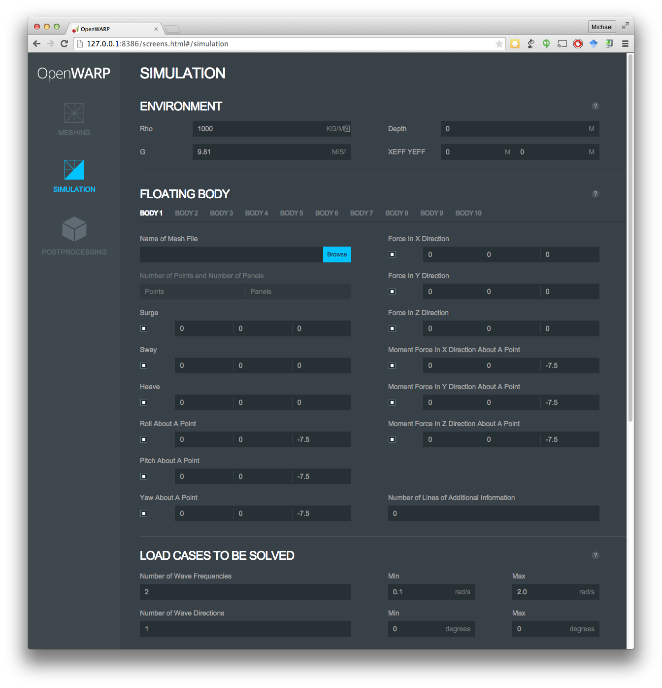

.. figure:: _static/OpenWARP.png
   :target: https://github.com/NREL/OpenWARP

Welcome to the  OpenWARP website
================================
OpenWARP is an open source boundary element simulation tool based on the `NEMOH code <http://lheea.ec-nantes.fr/doku.php/emo/nemoh/start>`_ developed by Ecole Centrale de Nantes. OpenWARP and NEMOH provide the ability to determine the frequency dependent added mass, radiation damping, and excitation coefficients that describe the behavior of a floating or submerged body in a wave field. These coefficients are widely used in conjunction with the Cummins equation :cite:`cummins1962` to model the behavior of wave energy conversion devices, ships, offshore platforms, and other floating structures.

OpenWARP code development was performed by `TopCoder <http://www.topcoder.com/>`_ with support from the `National Renewable Energy Laboratory <http://www.nrel.gov/water/>`_ and the `U.S. Department of Energy’s Water Power Program <http://energy.gov/eere/water/water-power-program>`_.

Code overview
-------------
The OpenWARP project adds a simple meshing capability and graphical user interface to NEMOH (see image below) and also incorporates several feature additions that are described in the :ref:`Documentation` section.

Contents
========
.. toctree::
   :maxdepth: 1

   license.rst
   acknowledgments.rst
   down_and_inst.rst
   doc.rst
   issues.rst

References
==========

.. bibliography:: OpenWARP.bib
   :style: plain

.. Indices and tables
.. ==================

.. * :ref:`genindex`
.. * :ref:`modindex`
.. * :ref:`search`

